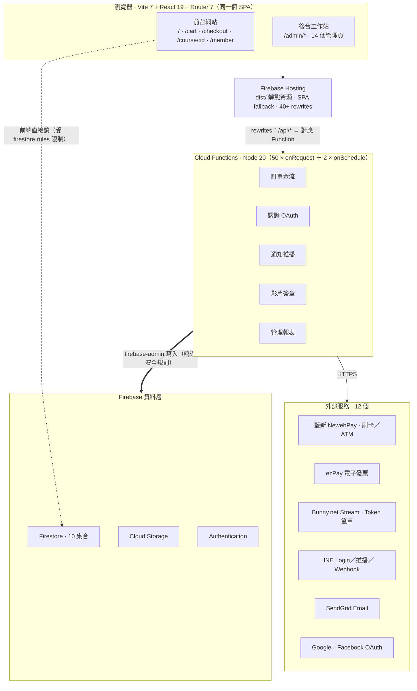
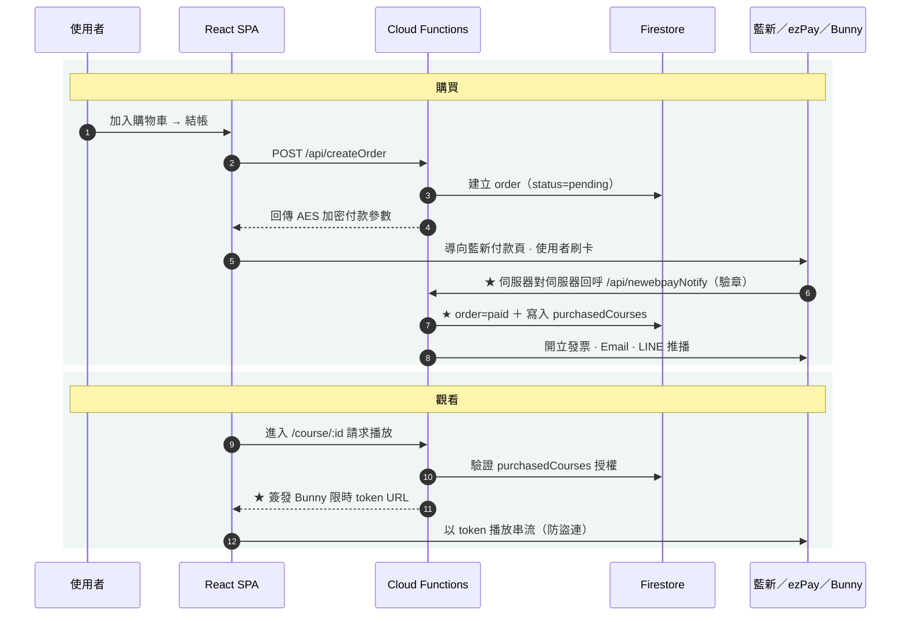
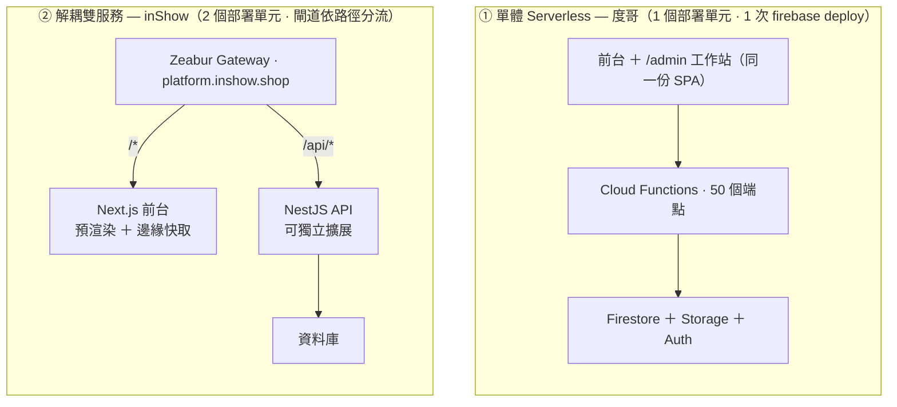
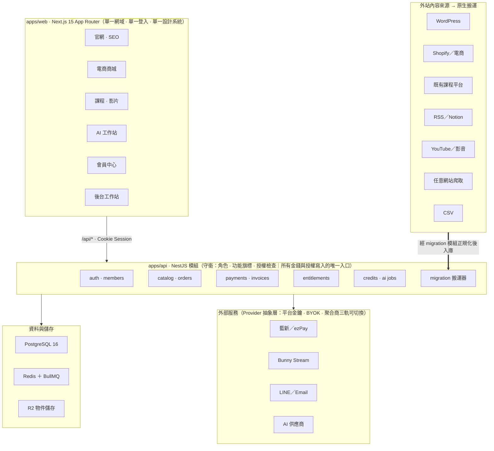
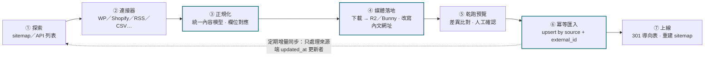

# 全新網站規劃：前端網站與後端工作站一體

> 架構藍圖 · 2026.09
> 拆解度哥線上課程網站的實作原始碼、對照 Airuru inShow 的雙服務架構，推導出一套可直接開工的整合平台規格——官網、AI 工作站、電商、課程、影片與會員共用一副骨架，並能把外站既有內容原生搬進來。

**分析標的**：度哥線上課程網站原始碼（50 Cloud Functions）｜platform.inshow.shop｜airuru.cc

---

## 目錄

1. [度哥課程網站：架構圖與資料流](#01-度哥課程網站架構圖與資料流)
2. [度哥 vs. inShow：逐項技術對照](#02-度哥-vs-inshow逐項技術對照)
3. [新專案技術規格書](#03-新專案技術規格書)
4. [部署清單](#04-部署清單)
5. [完整平台需求書](#05-完整平台需求書)
6. [外站內容原生搬運系統](#06-外站內容原生搬運系統)
7. [分期規劃與預算](#07-分期規劃與預算)

---

## 01 度哥課程網站：架構圖與資料流

這份原始碼的價值不在功能多，而在它示範了一個關鍵分界：**前端可以直接讀資料庫，但絕不能直接寫授權欄位**。以下兩張圖分別畫出「元件怎麼接」與「錢與授權怎麼流」。

### 系統架構：三層 ＋ 一條旁路



前台與後台工作站是**同一個 SPA**，靠路由與 AdminGuard 分隔，一次 `firebase deploy` 全部上線。虛線是關鍵旁路：讀取不經 API，由前端 SDK 直連 Firestore，安全全押在 `firestore.rules` 上；所有會改變金錢與授權的寫入，則一律繞到 Cloud Functions 用 admin 權限執行。

### 資料流：從刷卡到播放的 12 步



★ 的三步是整條鏈的信任錨點：授權**不是**在使用者付完款導回網站時寫入的（那可被偽造），而是等藍新以伺服器對伺服器回呼、驗章通過後才寫。播放權同理——影片網址每次由後端即時簽發、帶時效，前端拿不到永久網址。這兩個設計是課程／付費內容網站能不能防白嫖的分水嶺。

> **從原始碼讀到的 10 個 Firestore 集合**
> `users`（37 處引用）、`orders`（32）、`config`（8）、`invoices`（5）、`courses`（5）、`mergeRequests`（4）、`messageLogs`（3）、`broadcastLogs`（2）、`cartEvents`（1）、`admins`（1）。
> 其中 `orders / invoices / config / mergeRequests` 在規則中對前端一律 `write: false`。

---

## 02 度哥 vs. inShow：逐項技術對照

兩者都叫「前後端一體」，但一體的方式完全不同：度哥是**一個部署單元包住全部**，inShow 是**兩個服務靠閘道縫成同一個網域**。先看這個差別本身。



差別只在兩處，但後果很大：**部署單元數**與**是否存在路由閘道**。單體省事、上線快、綁死平台；解耦多一層維運，但前台與 API 可分別擴容、可分別搬家，也才撐得住多租戶 SaaS。

### 逐項對照 · 22 個面向

| 面向 | 度哥線上課程網站 | Airuru inShow 平台 |
|---|---|---|
| 前端框架 | Vite 7 ＋ React 19 ＋ React Router 7（純 CSR） | Next.js App Router ＋ React 19.2（RSC ＋ 預渲染） |
| 樣式系統 | TailwindCSS 4（`@tailwindcss/vite`） | Tailwind 風格 ＋ lucide 圖示集 |
| 表單／驗證 | 手寫驗證 ＋ crypto-js | zod（後端回傳 `Required` 型錯誤） |
| 後端框架 | Firebase Cloud Functions（Node 20 ＋ Express 4） | NestJS（Express 底層） |
| API 形態 | 50 個 `onRequest`，由 Hosting rewrites 映射 `/api/*` | 單一服務，原生 `/api/*` 路由 |
| 部署單元 | **1 個** `firebase deploy` 全包 | **2 個** 前台 ＋ 後端各自部署 |
| 託管平台 | Firebase Hosting ＋ Functions（Blaze 方案） | Zeabur（Caddy／阿里雲節點・HTTP/3） |
| 資料庫 | Firestore（NoSQL · 10 個集合） | 未公開（行為符合關聯式 ＋ ORM） |
| 認證機制 | Firebase Auth ＋ 自建 LINE／Google／FB OAuth Functions | Cookie Session（`credentials: true`） |
| 授權模型 | `firestore.rules` ＋ `admins/{uid}` 文件存在性 | `allowedFeatures[]` ＋ `role` ＋ `membershipTier` |
| 前端直連資料庫 | **是**：讀取走 SDK，安全押在規則上 | **否**：一律經 API |
| 金流 | 藍新 NewebPay（刷卡／ATM）＋ ezPay 電子發票 | 訂閱制 ＋ 點數制（TWD 計價） |
| 計費模型 | 一次性購課 · 退款流程完整 | 點數扣抵 ＋ 訂閱 ＋ BYOK 免扣點 |
| 影片／檔案 | Bunny.net Stream（Token 簽章防盜連） | Google Drive（歸檔進使用者自己的空間） |
| 通知管道 | SendGrid Email ＋ LINE 推播／Webhook | 站內為主，未見外部推播 |
| 排程任務 | 2 個 `onSchedule`（付款提醒・退款期限） | 未偵測到 |
| 後台工作站 | 同 repo `/admin/*`，14 個管理頁 | 同站路由 ＋ 功能旗標開關 |
| 多租戶 | 單租戶（單一品牌自用） | 多租戶（各會員自帶金鑰與雲端空間） |
| SEO 能力 | **弱**：純 CSR，首屏無內容 | **佳**：預渲染 ＋ `s-maxage` 邊緣長快取 |
| 安全標頭 | Firebase 預設（含基本防護） | **缺**：無 HSTS／CSP／X-Frame-Options |
| 供應商綁定 | **高**：深度綁 Firebase，搬遷成本大 | **低**：標準容器，可換平台 |
| 最適場景 | 快速交付單一品牌的交易型網站 | 產品化、可擴張的多租戶 SaaS |

> **取捨結論**
> 如果目標是「三個月內交付一個會賺錢的站」，度哥模式勝；如果目標是「做一個要養三年、會長出多條產品線的平台」，inShow 模式勝。
> 下面的規格書選第三條路：**用解耦的骨架，但維持單體的交付速度**——單一 Next.js 應用切 route group，API 獨立成服務，資料庫用標準 PostgreSQL。

---

## 03 新專案技術規格書

一副骨架同時長出官網、商城、課程、工作站、會員與後台。原則：**同一個網域、同一套登入、同一份設計系統、同一個資料庫**，但部署成兩個可獨立擴展的服務。

### 技術選型

| 層 | 選型 | 理由 |
|---|---|---|
| 前端 | Next.js 15 App Router ＋ React 19 ＋ TypeScript | 同一應用內混用 SSG／ISR／SSR：行銷頁要 SEO、工作站要互動 |
| 樣式 | TailwindCSS 4 ＋ shadcn/ui ＋ 自建 tokens | 六個介面共用一套設計系統，避免後台長得像另一個產品 |
| 後端 | NestJS 11 ＋ TypeScript（獨立服務） | 模組化切分清楚，DI 與守衛機制適合多角色授權 |
| 資料庫 | PostgreSQL 16 ＋ Prisma | 訂單／發票／點數需要交易與外鍵，NoSQL 會付出對帳代價 |
| 快取／佇列 | Redis ＋ BullMQ | AI 生成、影片轉檔、內容搬運都是長工作，必須離開請求週期 |
| 物件儲存 | Cloudflare R2（S3 相容） | 無流出費用，圖片與下載檔成本可控 |
| 影片串流 | Bunny.net Stream ＋ Token 簽章 | 度哥已驗證可行；轉檔、CDN、防盜連一次解決 |
| AI 供應商 | 介面化 Provider 層（平台金鑰／BYOK／聚合商） | 沿用 inShow 三軌制，換模型不動業務邏輯 |
| 金流／發票 | 藍新 NewebPay ＋ ezPay | 台灣在地、度哥已有可複用的驗章與回呼實作 |
| 認證 | Auth.js ＋ httpOnly Cookie Session | Email／LINE／Google／Facebook 共用一組帳號模型 |
| 通知 | Resend／SendGrid ＋ LINE Messaging API | 台灣客群 LINE 觸及率遠高於 Email |
| 部署 | Zeabur（web ＋ api ＋ postgres ＋ redis 四服務） | 已有實績、支援自訂網域與路徑路由，且不鎖定專有 API |
| 可觀測性 | Sentry ＋ 結構化日誌 ＋ Uptime 監控 | 金流回呼失敗必須第一時間知道 |

### 前端路由分組

```
apps/web （Next.js 單一應用）
├─ (marketing)   /、/about、/cases、/blog/[slug]          → SSG ＋ ISR，SEO／AEO 主戰場
├─ (shop)        /store、/product/[slug]、/cart、/checkout → ISR ＋ 動態結帳
├─ (learn)       /courses、/course/[slug]、/watch/[id]     → 登入後 SSR，簽章播放
├─ (studio)      /studio/generate、/scripts、/video、/assets → 純 CSR 工作站
├─ (account)     /member、/orders、/credits、/settings      → SSR
└─ (admin)       /admin/*  （14＋ 管理頁）                   → SSR ＋ 角色守衛
```

### 後端模組

| 領域 | 模組 | 職責 |
|---|---|---|
| identity | auth · members | 註冊登入、社群綁定、帳號合併、角色與功能旗標 |
| commerce | catalog · cart · orders | 商品與課程共用 SKU 模型、購物車、折扣碼、訂單狀態機 |
| money | payments · invoices · refunds | 建單、回呼驗章、發票開立作廢、退款流程與不退款名單 |
| entitlement | access · credits | 課程授權、點數帳本、訂閱效期——唯一可寫入者是後端 |
| ai | studio · jobs | 模板庫、生成任務佇列、Provider 抽換、成本記錄 |
| media | assets · streaming | 上傳、轉檔、Bunny 簽章、作品歸檔 |
| content | cms · seo | 文章與頁面、結構化資料、sitemap、301 導向表 |
| ingest | migration | 外站連接器、正規化、媒體重託管、冪等匯入（詳見 06） |
| ops | notify · analytics · admin | Email／LINE 推播、事件追蹤、報表與後台設定 |

### 核心資料模型（PostgreSQL）

| 資料表 | 關鍵欄位 | 寫入者 |
|---|---|---|
| users | email、role、status、membership_tier、allowed_features | API |
| identities | user_id、provider、provider_uid（社群綁定與合併） | API |
| products | type（physical／course／credit_pack）、price、sku | 後台 |
| courses / chapters | slug、is_published、video_provider_id | 後台 |
| orders / order_items | status、amount、provider_trade_no | **僅 API** |
| entitlements | user_id、product_id、granted_at、expires_at | **僅金流回呼** |
| credit_ledger | type、amount、balance_after、job_id | **僅 API** |
| ai_jobs | status、provider、cost、result_url | 佇列 Worker |
| contents | source、external_id、slug、canonical_url、status | 後台／搬運器 |
| redirects | from_path、to_path、code（301） | 搬運器 |

> **從度哥繼承的三條鐵律**
> 1. **授權欄位永不開放前端寫入**：`entitlements`、`credit_ledger`、`orders` 只接受後端寫入。
> 2. **付款以伺服器回呼為準**：使用者導回頁面只更新畫面，不作數。
> 3. **媒體網址即時簽發、帶時效**：影片與下載檔不存在永久公開網址。

---

## 04 部署清單

照順序做完即可上線。每一步都標了「做完的判準」，避免做到一半不知道有沒有成功。

### 01 建立雲端資源
Zeabur 專案內開四個服務：`web`、`api`、`postgres`、`redis`。另開 Cloudflare R2 bucket 與 Bunny.net Stream Library。
**判準**：四個服務皆為 Running，資料庫連線字串可從 api 服務讀到。

### 02 網域與路由
主網域指向 `web`；在閘道加一條規則把 `/api/*` 導到 `api` 服務。DNS 設 A／CNAME 後等憑證簽發。
**判準**：`curl -I https://你的網域/api/health` 回 200，且首頁正常。

### 03 環境變數
分成三組：前端可公開（`NEXT_PUBLIC_*`）、後端機密、Worker 專用。機密一律存在平台的 Secret，不進 Git。

```env
# api 服務
DATABASE_URL / REDIS_URL / SESSION_SECRET
NEWEBPAY_MERCHANT_ID / NEWEBPAY_HASH_KEY / NEWEBPAY_HASH_IV
EZPAY_MERCHANT_ID / EZPAY_HASH_KEY / EZPAY_HASH_IV
BUNNY_LIBRARY_ID / BUNNY_API_KEY / BUNNY_SIGNING_KEY
R2_ACCOUNT_ID / R2_ACCESS_KEY / R2_SECRET / R2_BUCKET
LINE_CHANNEL_ACCESS_TOKEN / LINE_CHANNEL_SECRET
GOOGLE_CLIENT_ID / GOOGLE_CLIENT_SECRET
AI_PROVIDER_KEY / SENTRY_DSN / FRONTEND_URL
```

**判準**：啟動時以 zod 驗證環境變數，缺一個就開不起來（而不是上線後才壞）。

### 04 資料庫遷移與種子
`prisma migrate deploy` ＋ 種子資料（AI 模板、商品分類、系統設定、第一個管理員）。
**判準**：後台能用種子管理員帳號登入，且看得到模板清單。

### 05 金流串接與回呼
先在藍新測試環境跑通：建單 → 付款 → 回呼驗章 → 寫入 `entitlements`。回呼網址必須是公開可達的 HTTPS。
**判準**：測試刷卡後，`orders.status` 變 `paid` 且使用者拿到授權，全程不靠前端。

### 06 影片與檔案
上傳一支測試影片到 Bunny，開啟 Token Authentication，驗證未帶簽章的網址會被拒絕。
**判準**：直接貼影片網址無法播放，經由 `/api` 取得的簽章網址可播且會過期。

### 07 安全標頭與稽核
補上 inShow 缺的那幾項：`Strict-Transport-Security`、`Content-Security-Policy`、`X-Frame-Options`、`Referrer-Policy`、`X-Content-Type-Options`。
**判準**：securityheaders.com 評分 A 以上；CORS 白名單只留正式網域。

### 08 SEO 基礎建設
動態 `sitemap.xml`、`robots.txt`、每頁 OG 圖與結構化資料（Article／Product／Course／FAQ）、301 導向表生效。
**判準**：Search Console 可成功提交 sitemap，且隨機抽三頁的預渲染 HTML 內含完整內文。

### 09 監控與備份
Sentry 接前後端；PostgreSQL 每日自動備份並實際還原一次；金流回呼失敗要發告警到 LINE。
**判準**：手動製造一次回呼失敗，告警確實送達。

### 10 CI/CD 與上線
main 分支自動部署、PR 建預覽環境；上線前跑一次 Lighthouse 與付款全流程手動驗收。
**判準**：回滾演練成功——能在 5 分鐘內退回前一版。

> ⚠️ **立即要處理的既有風險**
> 上傳的壓縮檔內含**真實 `.env`**：Firebase、藍新 HashKey／IV、Bunny API Key、LINE Token 皆為明文。這份檔案只要外流過一次，等同金流與影片庫被接管。建議：把該檔從壓縮包移除、輪換上述所有金鑰、確認 `.gitignore` 已排除 `.env`，日後交付一律只給 `.env.example`。

---

## 05 完整平台需求書

七大模組共用一副骨架。下圖是全貌——注意所有介面走同一個網域、同一組登入，後面共用同一套訂單與授權核心。



六個介面不是六個專案，而是同一個 Next.js 應用的六個路由分組；它們共用登入狀態、設計系統與 API。底部是本需求特有的一環：外站內容從七類來源進來，全部經 migration 模組正規化後才落地，而不是各自寫一支一次性腳本。

### 模組需求明細

| 模組 | 必備功能 | 驗收標準 |
|---|---|---|
| ① 品牌官網（SEO 獲客） | 首頁、關於、服務、實績案例、部落格（分類／標籤／作者）、聯絡表單、結構化資料、動態 sitemap | 每頁預渲染 HTML 含完整內文；Lighthouse SEO ≥ 95；文章可排程發佈 |
| ② AI 創作工作站（SaaS 產品） | 模板庫、參數表單、參考圖上傳、生成佇列與進度、作品庫、點數扣抵與退點、BYOK 金鑰管理 | 生成失敗自動退點；同時 50 個任務不阻塞網站；成本可逐筆歸戶 |
| ③ 電商系統 | 商品／規格／庫存、購物車、折扣碼、運費規則、物流出貨狀態、退換貨 | 庫存不超賣（交易鎖）；訂單狀態機不可逆向；可匯出對帳檔 |
| ④ 訂單與金流 | 建單、刷卡／ATM／超商、回呼驗章、電子發票開立與作廢、退款申請與審核、不退款名單 | 授權僅由回呼寫入；重複回呼冪等；金額與發票逐筆可稽核 |
| ⑤ 課程銷售 | 課程／章節、試看、購買後授權、學習進度、結業證明、問答區 | 未購買者無法取得任何播放網址；進度跨裝置同步 |
| ⑥ 影片串流 | 上傳轉檔、多畫質、Token 簽章、續播、播放統計、批量上傳工具 | 裸網址無法播放；簽章有效期可設定；支援 1GB 以上檔案 |
| ⑦ 會員系統 | Email／LINE／Google／FB 登入、帳號合併、個資與發票資訊、訂單與授權總覽、點數帳本、訂閱管理 | 同一人用不同管道登入可合併為單一帳號且不遺失授權 |

### 非功能需求

| 面向 | 要求 |
|---|---|
| 效能 | 行銷頁 LCP < 2.0s（預渲染 ＋ 邊緣快取）；API p95 < 300ms；長工作一律進佇列，不佔請求 |
| 資安 | 完整安全標頭、CORS 白名單；金鑰只存 Secret，不進 Git；金流回呼驗章 ＋ 冪等鍵；後台操作留稽核日誌 |
| SEO／AEO | 每頁獨立 title／描述／OG；Article・Product・Course・FAQ 結構化資料；搬遷保留 301 對照表 |
| 維運 | 每日備份並定期演練還原；錯誤追蹤與失敗告警到 LINE；5 分鐘內可回滾 |

---

## 06 外站內容原生搬運系統

「原生搬運」的門檻不在抓資料，而在三件事：**媒體必須落地成自己的**、**重跑不能產生重複**、**舊網址的 SEO 權重不能斷**。



**內容正規化模型（canonical content）**
`source · external_id · type · title · slug · body(HTML→結構化) · excerpt · media[] · author · tags[] · published_at · canonical_url · original_url`

關鍵在第 ④ 與第 ⑥ 步。媒體不落地，就會留下指向舊站的熱連結——舊站一關全部破圖；沒有以 `source + external_id` 當冪等鍵，重跑一次就多一份重複內容，SEO 直接自我競食。第 ⑤ 步的乾跑預覽是給人看的最後一道閘，避免把 800 篇爛資料一次灌進正式站。

### 連接器規格

| 來源 | 取得方式 | 可搬內容 | 注意 |
|---|---|---|---|
| WordPress | `/wp-json/wp/v2/*` REST API | 文章、頁面、分類、標籤、媒體庫、作者 | 古騰堡區塊需轉為結構化內容；短代碼要清洗 |
| Shopify／電商 | Admin API 或商品 CSV | 商品、規格、圖片、描述、分類 | 規格組合易爆量，需先對應 SKU 模型 |
| 既有課程平台 | 官方匯出檔／API／人工 CSV | 課程、章節、學員名單、購買紀錄 | 學員授權需對應到新 `entitlements`，不可漏 |
| RSS／Notion／Medium | Feed 或官方 API | 文章內文、封面、發佈時間 | RSS 常只有摘要，需回原頁補全文 |
| YouTube／影音 | Data API ＋ 檔案匯入 | 影片、標題、描述、章節 | 大檔走非同步轉檔；版權需確認 |
| 任意網站 | sitemap 爬取 ＋ 正文萃取 | 文章正文、圖片、metadata | 需尊重 robots 與著作權，僅限自有或已授權站台 |
| 通用 CSV／JSON | 後台上傳 ＋ 欄位對應介面 | 任何表格化內容 | 保留對應設定以便重複匯入 |

> **搬遷不掉排名的四個動作**
> 1. 舊網址逐筆對應新網址，輸出 `redirects` 表並以 301 生效（不要用 302）。
> 2. 保留原 `slug`；真的要改，就同時保留舊路徑的導向。
> 3. 內文中指向舊站的內部連結一併改寫，避免導向鏈。
> 4. 上線後提交新 sitemap，並在 Search Console 觀察 4 週涵蓋率。

> ⚠️ **法務前提**
> 內容搬運僅適用於**自有站台、客戶授權站台，或明確開放的來源**。搬運第三方內容前須取得書面授權，並確認圖片與影片的授權範圍涵蓋新的散布方式；爬取行為亦須遵守對方 robots 與服務條款。

---

## 07 分期規劃與預算

不建議一次做完。先讓現金流跑起來（官網＋課程＋金流），再長出工作站與電商。

### 四階段交付

| 階段 | 範圍 | 產出 | 建議工期 |
|---|---|---|---|
| P1 地基 | 骨架、設計系統、會員系統、官網 ＋ SEO、內容搬運器 v1（WordPress／CSV） | 官網可上線接單、舊內容搬完且 301 生效 | 4–6 週 |
| P2 變現 | 訂單金流、電子發票、課程銷售、影片串流、後台工作站 v1 | 可賣課、可收款、可開發票、可出貨 | 5–7 週 |
| P3 產品化 | AI 創作工作站、點數與訂閱、佇列與 Provider 抽象層 | SaaS 可對外開賣，成本可歸戶 | 6–8 週 |
| P4 規模化 | 完整電商（庫存物流）、進階報表、搬運器擴充、效能與資安強化 | 可承接多品牌與多來源內容 | 4–6 週 |

### 月營運成本估算

以月活 5,000 · 影片 200 支 · AI 生成 10,000 次估算。

| 項目 | 方案 | 月費估算（TWD） |
|---|---|---|
| 應用託管 | Zeabur：web ＋ api ＋ postgres ＋ redis | 900 – 2,500 |
| 影片串流 | Bunny Stream（儲存 ＋ 流量） | 600 – 2,000 |
| 物件儲存 | Cloudflare R2（免流出費） | 100 – 400 |
| AI 供應商 | 依生成量，可轉嫁為點數收入 | 3,000 – 15,000 |
| 金流手續費 | 藍新約 2.2%–2.8% 營業額 | 依營收 |
| 通知服務 | LINE Messaging ＋ Email | 0 – 1,500 |
| 監控 | Sentry ＋ Uptime | 0 – 900 |
| **合計** | 不含金流手續費與 AI 轉嫁部分 | **約 1,600 – 7,300** |

### 需要你先拍板的五件事

| # | 決策 | 為什麼現在就要定 |
|---|---|---|
| 01 | 單一品牌或多品牌？ | 若未來要接客戶站台，資料模型一開始就要帶 `tenant_id`，事後補代價極高。 |
| 02 | AI 成本誰吸收？ | 平台金鑰扣點、使用者自帶金鑰、或兩者並行——決定點數定價與毛利結構。 |
| 03 | 電商賣實體嗎？ | 一旦有實體商品就多出庫存、運費與物流串接，工期與複雜度明顯上升。 |
| 04 | 要搬哪些站、多少內容？ | 來源類型與筆數直接決定搬運器要做幾個連接器、要不要做人工對應介面。 |
| 05 | 沿用 Firebase 還是換 PostgreSQL？ | 沿用可複用度哥大量程式碼、最快；換掉才撐得住報表、對帳與多租戶。 |

---

## 分析依據

度哥線上課程網站原始碼（`package.json`、`firebase.json`、`firestore.rules`、`src/`、`functions/src/`）；platform.inshow.shop 已登入工作階段之逐頁操作與網路請求側錄、未帶憑證之 HTTP 標頭交叉驗證；airuru.cc 之 HTML／sitemap／逐路由標題比對。成本與工期為估算值，實際依規格與流量而定。機密金鑰全程未取用亦未顯示。
